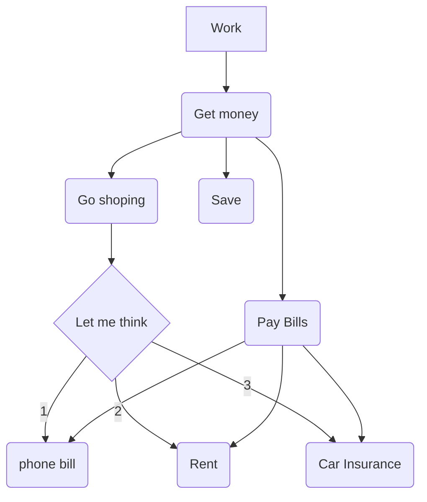

```mermaid
flowchart TD 
A[Work] -->B(Get money)
B --> C(Go shoping)
B --> D(Pay Bills)
B --> E(Save)
C --> F{Let me think}
F -->|1| G[New monitor]
F -->|2| H[Food]
F -->|3| I[Gift]

D --> G(phone bill)
D --> H(Rent)
D --> I(Car Insurance)
```
