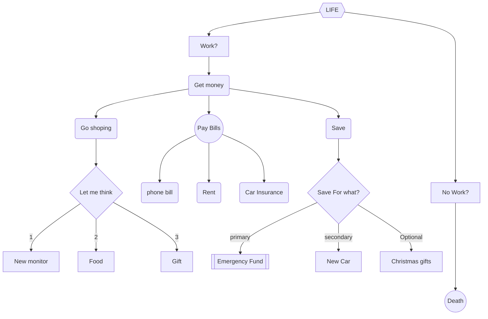

```mermaid
flowchart TD 
AA{{LIFE}} -->A[Work?] -->B(Get money)
B --> C(Go shoping)
B --> D((Pay Bills))
B --> E(Save)
C --> F{Let me think}
F -->|1| G[New monitor]
F -->|2| H[Food]
F -->|3| I[Gift]

D --> J(phone bill)
D --> K(Rent)
D --> M(Car Insurance)

E --> N{Save For what?}
N --> |primary| O[[Emergency Fund]]
N --> |secondary| P[New Car]
N --> |Optional| Q[Christmas gifts]

AA ----->X[No Work?]
X --->L((Death))

```
