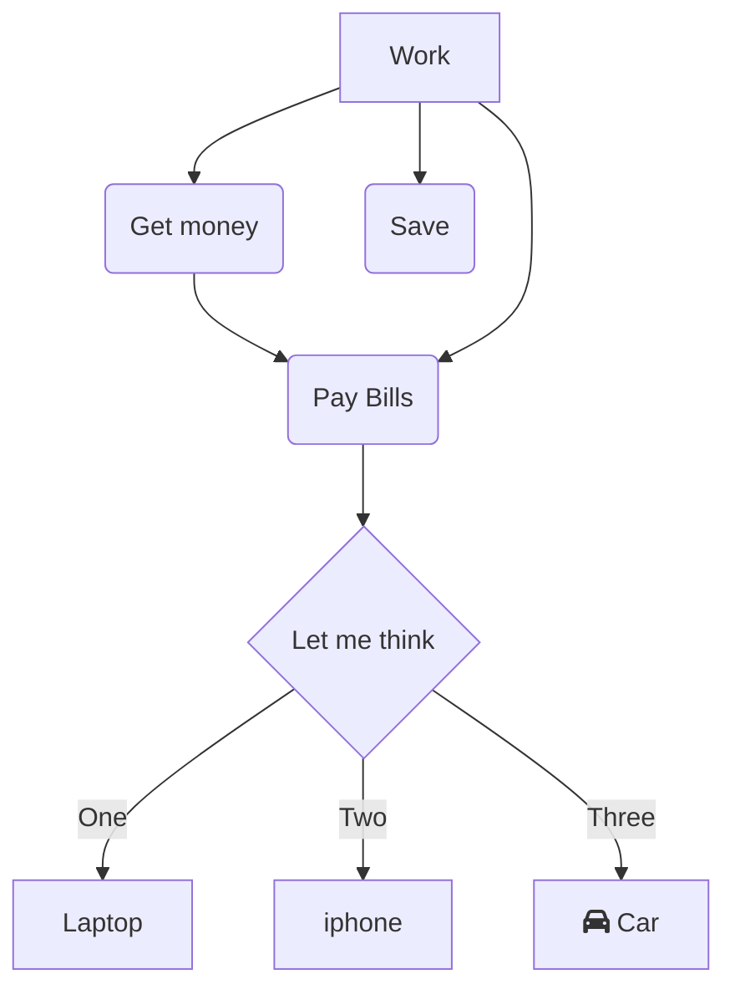

```mermaid
flowchart TD 
A[Work] -->B(Get money)
B --> C(Go shoping)
A --> C(Pay Bills)
A --> D(Save)
C --> F{Let me think}
F -->|One| G[Laptop]
F -->|Two| H[iphone]
F -->|Three| I[fa:fa-car Car]

```
